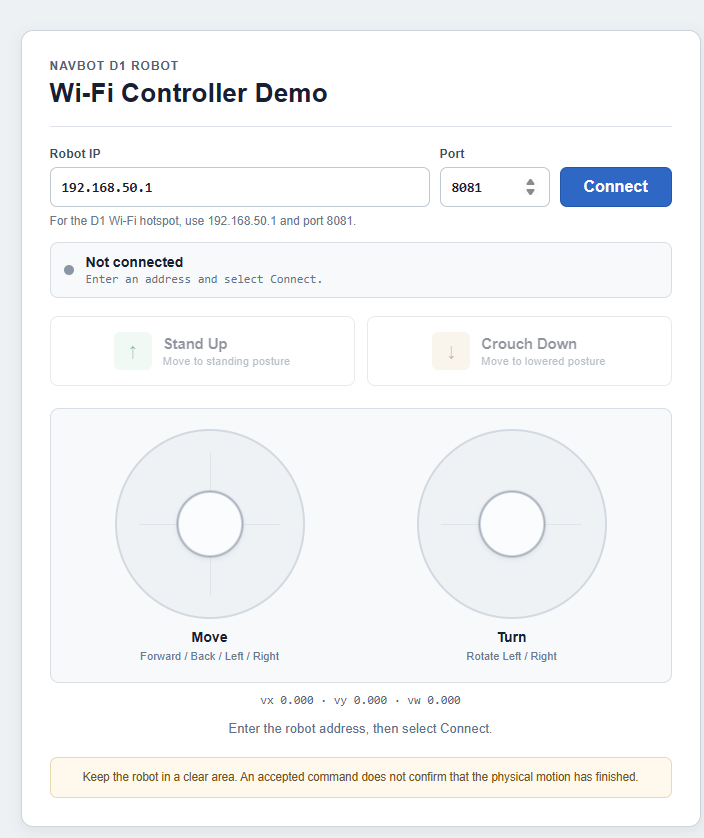

# NavBot D1 Wi-Fi Web Controller Demo


This is a small browser remote control for the NavBot D1 robot dog. You can open it without installing a framework, connect to your robot, change its posture, and drive it with two on-screen joysticks.



_The controls are disabled until the robot is connected and Start Learning has been accepted._

## Start Here

For a standard D1 hotspot connection, these are the only steps you need:

1. Put the robot in a clear area and keep the physical emergency stop within reach.
2. Connect your computer, phone, or handheld device to the D1 Wi-Fi hotspot.
3. Double-click `index.html` to open the controller in a browser.
4. Keep **Robot IP** as `192.168.50.1` and **Port** as `8081`, unless your robot uses different settings.
5. Select **Connect**.
6. Wait until the message says **Learning mode ready**. The buttons and joysticks will become active.
7. Use **Stand Up**, **Crouch Down**, and the two joysticks to control the robot.
8. Select **Disconnect** when you finish.

> **Safety:** Browser controls are not an emergency-stop system. Test at low speed in an open area and keep access to the robot's physical safety controls.

### What Each Control Does

| Control | What you do | What happens |
| --- | --- | --- |
| **Robot IP** | Enter the robot's IP address. | Chooses which robot the page will connect to. The D1 hotspot default is `192.168.50.1`. |
| **Port** | Enter the control-service port. | Chooses the WebSocket port. The default is `8081`. |
| **Connect** | Select once after entering the address. | Opens the robot socket and automatically starts Learning mode. |
| **Disconnect** | Select when you finish or need to change the address. | Stops local motion, sends zero velocity when possible, and closes the socket. |
| **Stand Up** | Select once. | Requests the standing posture. |
| **Crouch Down** | Select once. | Requests the lowered/lying posture. |
| **Move joystick** | Drag in any direction. | Moves forward, backward, left, right, or diagonally. |
| **Turn joystick** | Drag left or right. | Rotates the robot left or right. |

You do not need to look for a **Start Learning** button. The demo sends that command automatically after you select Connect. Controls remain disabled if the robot does not accept it.

The page does not join Wi-Fi, connect, or reconnect by itself. The user always controls those actions.

## Related Repositories

- Frontend application and UI reference: [D1_Flutter](https://github.com/NavBotHub/D1_Flutter)
- Robot backend and protocol source: [D1_Backend](https://github.com/NavBotHub/D1_Backend)

For additional commands, protocol fields, HTTP APIs, video integration, telemetry, error handling, and extension guidance, see [README_MORE.md](README_MORE.md).

## Requirements

- A NavBot D1 robot with its control service running.
- A computer, phone, tablet, or handheld device with a modern browser.
- Network access to the robot.
- Optional: a local static HTTP server for browsers or backends that do not allow direct `file://` use.
- Direct access to the robot's physical emergency stop during motion testing.

No npm installation, build command, JavaScript framework, or generated bundle is required.

## Default D1 Network Settings

| Setting | Default value |
| --- | --- |
| Robot IP | `192.168.50.1` |
| Control port | `8081` |
| WebSocket path | `/ws/robot` |
| Complete WebSocket URL | `ws://192.168.50.1:8081/ws/robot` |

The Wi-Fi SSID and password depend on the robot configuration and are not defined by this demo.

<details>
<summary><strong>Developer details: exact UI behavior and command mapping</strong></summary>

## Complete UI and Command Reference

This section describes every interactive control and status element shown by the demo.

### Connection Inputs and Button

| UI element | Default | Function | Network or command effect |
| --- | --- | --- | --- |
| **Robot IP** input | `192.168.50.1` | Specifies the D1 hostname or IP address. Use the default when connected directly to the standard D1 hotspot. | Does not send a robot command. It becomes the host in `ws://<host>:<port>/ws/robot`. |
| **Port** input | `8081` | Specifies the D1 WebSocket control-service port. Valid values are `1` through `65535`. | Does not send a robot command. It becomes the port in the WebSocket URL. |
| **Connect** button | Available while disconnected | Validates the IP/host and port, then opens the robot WebSocket. | Opens `/ws/robot`. After `open`, automatically sends **Start Learning**, `ClientRobotMessage` field `8`, mode `3`. |
| **Disconnect** button | Replaces Connect while connecting or connected | Stops local control and closes the current WebSocket. | If the socket is open, attempts to send one zero-velocity command through field `2`, then closes the socket with code `1000`. No command is saved for replay. |

The page never selects a Wi-Fi network and never presses Connect automatically. Changing either input only updates the target preview.

#### Connection Sequence

```text
User selects Connect
  → open ws://<Robot IP>:<Port>/ws/robot
  → WebSocket open
  → send Start Learning (field 8, mode 3, new seq)
  → wait up to 3 seconds for field-20 ACK with the same seq
  → result 1: enable Stand Up, Crouch Down, and both joysticks
  → timeout/rejection: keep all robot controls disabled
```

### Posture Buttons

Both posture buttons send a binary `D1ModeCommand` inside `ClientRobotMessage` field `8`. Each click receives a new non-zero sequence number. The next posture command is disabled until the matching field-20 ACK arrives or the three-second timeout expires.

| Button | Mode value | Function | Command values |
| --- | ---: | --- | --- |
| **Stand Up** | `1` | Requests the robot's standing posture. | `seq = next sequence`, `mode = 1`, `client_time_ms = current Unix time` |
| **Crouch Down** | `2` | Requests the robot's lowered/lying posture. The backend/protocol may call this Lie Down. | `seq = next sequence`, `mode = 2`, `client_time_ms = current Unix time` |

Before either posture command is sent, the demo resets both joysticks and attempts to send zero velocity.

The mode payload represented in Protobuf form is:

```proto
message ClientRobotMessage {
  D1ModeCommand d1_mode = 8;
}

message D1ModeCommand {
  uint32 seq = 1;
  D1Mode mode = 2;
  int64 client_time_ms = 3;
}
```

The successful response is `D1ModeAck` in incoming `RobotMessage` field `20`. Only `result = 1` is treated as accepted.

### Automatic Start Learning Command

**Start Learning is intentionally not displayed as a button.** It is sent automatically once after every user-initiated WebSocket connection opens.

| Command | Mode value | When sent | Effect on UI |
| --- | ---: | --- | --- |
| Start Learning | `3` | Immediately after WebSocket `open` | Controls remain disabled until the matching ACK returns `result = 1`. |

If this command times out or returns a non-success result, the user must disconnect, correct the backend/robot condition, and connect again.

### Left Joystick — Move

The left joystick controls planar translation. Its visual position is normalized to the range `-1.0` through `1.0`. Values within the `0.08` center dead zone become zero.

| Joystick direction | Normalized input | Robot value | Requested movement |
| --- | --- | --- | --- |
| Up | `leftY > 0` | `linear.x / vx > 0` | Forward |
| Down | `leftY < 0` | `linear.x / vx < 0` | Backward |
| Left | `leftX < 0` | `linear.y / vy > 0` | Lateral left |
| Right | `leftX > 0` | `linear.y / vy < 0` | Lateral right |
| Diagonal | Both axes non-zero | Both `vx` and `vy` non-zero | Combined translation |

Conversion:

```text
vx =  0.9 × leftY
vy = -0.5 × leftX
```

The circular input is magnitude-clamped, so diagonal input cannot exceed the normalized joystick radius.

### Right Joystick — Turn

The right joystick controls yaw rotation only. Vertical movement is ignored, and the horizontal axis uses the same `0.08` center dead zone.

| Joystick direction | Normalized input | Robot value | Requested movement |
| --- | --- | --- | --- |
| Left | `rightX < 0` | `angular.z / vw > 0` | Rotate left |
| Right | `rightX > 0` | `angular.z / vw < 0` | Rotate right |

Conversion:

```text
vw = -0.4 × rightX
```

### Joystick Velocity Command

Both joysticks update one combined velocity command. While either joystick is held, the newest values are sent every `20 ms` as binary `ClientRobotMessage` field `2`:

```proto
message ClientRobotMessage {
  Twist cmd_vel = 2;
}

message Twist {
  Vector3 linear = 1;
  Vector3 angular = 2;
}
```

The demo populates the Twist values as follows:

| Protobuf value | Demo value | Maximum magnitude | Unit |
| --- | --- | ---: | --- |
| `linear.x` | `vx` | `0.9` | m/s |
| `linear.y` | `vy` | `0.5` | m/s |
| `linear.z` | `0` | `0` | m/s |
| `angular.x` | `0` | `0` | rad/s |
| `angular.y` | `0` | `0` | rad/s |
| `angular.z` | `vw` | `0.4` | rad/s |

Releasing one joystick resets only that joystick's axes. If the other joystick remains active, its current command continues. Releasing the final active joystick stops the 20 ms timer and immediately sends the combined zero value.

### Status and Read-Only Displays

| Display | Meaning | Sends a command? |
| --- | --- | --- |
| Connection dot and text | Shows disconnected, connecting, connected, or failed state and the current target. | No |
| Command status | Shows Start Learning progress, posture-command progress, ACK results, timeout, or connection errors. | No |
| `vx · vy · vw` display | Shows the velocity values currently produced by the two joysticks. | No; it reflects the field-2 command generated by the joysticks. |
| D1 hotspot hint | Reminds the user of the default `192.168.50.1:8081` endpoint. | No |

### Control Availability Rules

- The Robot IP and Port inputs are editable only while disconnected.
- Stand Up, Crouch Down, and both joysticks are disabled before connection.
- They remain disabled while the automatic Start Learning ACK is pending.
- They are enabled only after Start Learning returns `result = 1`.
- They are temporarily disabled while a posture command is awaiting its ACK.
- Any socket close disables all robot controls and clears joystick motion.

</details>

## Detailed Setup and Use

### 1. Connect the Device to the D1 Wi-Fi

Open the operating-system Wi-Fi settings and connect the computer or mobile device to the D1 hotspot. A normal web page cannot select or join Wi-Fi automatically.

If the robot is connected through another network, use the IP address assigned to the robot on that network instead.

### 2. Open the Demo

The demo can normally be used by opening `index.html` directly in a browser. No installation or build step is required:

1. Open this `Web` directory.
2. Double-click `index.html`, or use the browser's **Open File** command.
3. The page opens with a local address similar to:

   ```text
   file:///.../Web/index.html
   ```

4. Enter the D1 IP and port, then select **Connect**.

When opened through `file://`, the demo still uses the plain robot WebSocket endpoint:

```text
ws://192.168.50.1:8081/ws/robot
```

Direct file use works because the demo has no npm dependencies, ES modules, build output, or local `fetch()` requirements. The browser can load `index.js`, `styles.css`, and `image.png` through their relative paths.

However, browser and backend security behavior can vary. A page opened through `file://` may send a WebSocket origin of `null`. If the D1 backend validates and rejects that origin, the page will open but the WebSocket connection will fail.

#### Recommended Fallback: Use a Static Web Server

If direct file use fails—or for more consistent behavior across browsers—open a terminal in this `Web` directory and start a local static server.

Python 3:

```bash
python -m http.server 8000
```

Node.js:

```bash
npx serve .
```

Then open the address printed by the server. For the Python example, use:

```text
http://localhost:8000
```

Serving the files over HTTP gives the page a normal origin such as `http://localhost:8000` and is the recommended option for development and compatibility testing.

### 3. Enter the Robot Address

Enter the robot control endpoint in the connection fields:

- **Robot IP:** `192.168.50.1` when connected directly to the standard D1 hotspot.
- **Port:** `8081` for the default D1 control service.

The page may also receive values through query parameters:

```text
http://localhost:8000/?host=192.168.50.1&port=8081
```

Query parameters only prefill the fields. They do not start a connection.

### 4. Connect to the Robot

Select **Connect**. The demo opens:

```text
ws://<robot-ip>:<port>/ws/robot
```

When the controller page itself is served over HTTPS, it selects `wss://` to avoid mixed-content violations. The robot or a reverse proxy must support WSS in that deployment.

During connection:

1. The IP and port fields are locked.
2. The posture buttons and joysticks remain disabled.
3. After the WebSocket opens, the demo automatically sends **Start Learning** (`mode = 3`).
4. The demo waits up to three seconds for the matching mode ACK.
5. Controls become available only when the ACK result is successful (`result = 1`).

There is no visible Start Learning button because it is part of connection initialization.

If initialization fails, the socket may still be open, but robot controls remain disabled. Select **Disconnect**, verify the robot service, and connect again.

### 5. Control the Robot

Place the robot in a clear test area before sending any command.

#### Posture Buttons

| Control | Mode | Result |
| --- | ---: | --- |
| **Stand Up** | `1` | Requests the standing posture. |
| **Crouch Down** | `2` | Requests the lowered/lying posture. |

Each posture command uses a new sequence number. The UI waits for the matching ACK before enabling another command.

#### Left Joystick — Move

- Push up: move forward.
- Push down: move backward.
- Push left: move laterally left.
- Push right: move laterally right.
- Diagonal input combines forward/backward and lateral motion.

#### Right Joystick — Turn

- Push left: rotate left.
- Push right: rotate right.
- Vertical movement is ignored.

The demo uses the same sign conversion and default limits as the reference controller:

```text
vx =  0.9 × left Y
vy = -0.5 × left X
vw = -0.4 × right X
```

The displayed `vx`, `vy`, and `vw` values are the current command values. While either joystick is active, the latest velocity is transmitted every `20 ms`.

### 6. Stop Motion and Disconnect

The joystick returns to zero when released. The demo also clears motion and attempts to send a zero-velocity frame when:

- the browser window loses focus;
- the page becomes hidden;
- the user selects **Disconnect**;
- the WebSocket closes;
- the page is unloaded.

Select **Disconnect** before leaving the controller. The page does not reconnect automatically. Select **Connect** again when a new connection is required.

## Understanding the Status

| Status | Meaning |
| --- | --- |
| `Not connected` | No active WebSocket. Address fields can be edited. |
| `Connecting to D1...` | A user-requested WebSocket connection is in progress. |
| `D1 connected` | The WebSocket is open; Start Learning may still be waiting for its ACK. |
| `Learning mode ready` | Initialization succeeded and controls are enabled. |
| `Start Learning failed` | Initialization was rejected or timed out; controls remain disabled. |

An accepted command confirms only that the backend accepted the request. It does not confirm that physical movement has completed.

## Project Files

| File | Purpose |
| --- | --- |
| `index.html` | Controller markup, connection form, action buttons, joystick elements, and status regions. |
| `index.js` | WebSocket lifecycle, binary protocol codec, mode ACK handling, joystick input, velocity transmission, and safe-stop logic. |
| `styles.css` | Responsive demo layout and control states. |
| `README.md` | Operation guide for this demo. |
| `README_MORE.md` | Extended Wi-Fi protocol and custom-controller integration reference. |

## Browser and Network Notes

- `/ws/robot` accepts binary Protobuf frames. Do not send JSON strings on this channel.
- A browser cannot automatically join the D1 hotspot.
- VPNs, mobile-data routing, and another interface using the same subnet can prevent access to `192.168.50.1`.
- An HTTPS page normally cannot connect to a plain `ws://` endpoint. Serve the demo over HTTP on the isolated D1 network, or deploy a trusted HTTPS/WSS reverse proxy.
- The control WebSocket and MJPEG video service can use different ports. Test them independently.
- Do not expose the unauthenticated robot-control service to a public or untrusted network.

## Troubleshooting

### Why Does Connect Fail?

1. Confirm that the device is connected to the correct D1 Wi-Fi.
2. Confirm that the robot address is `192.168.50.1`, unless the deployment uses another address.
3. Confirm that port `8081` and path `/ws/robot` are available.
4. Disable a conflicting VPN or network route temporarily.
5. Check the browser developer console for mixed-content, certificate, or connection errors.

### Why Are the Controls Still Disabled?

The automatic Start Learning command did not receive a successful ACK. Check the status message, verify that the learning service is available in the backend, and make sure binary mode frames and field-20 ACKs match the robot firmware.

### What Does a Posture Timeout Mean?

The demo waits three seconds for a matching ACK. A timeout is an unknown result; do not assume the robot rejected or completed the command, and do not automatically resend it.

### Why Does a Joystick Not Move the Robot?

1. Confirm that the status says `Learning mode ready`.
2. Confirm that the joystick visually moves and the velocity display changes.
3. Verify that the backend accepts `ClientRobotMessage` field `2` Twist frames.
4. Test a zero-velocity frame before non-zero motion.
5. Compare the deployed backend schema with [D1_Backend](https://github.com/NavBotHub/D1_Backend).

## Extending the Demo

Use [README_MORE.md](README_MORE.md) when adding:

- more D1 mode commands;
- navigation goals and initial-pose controls;
- map management;
- robot telemetry and status displays;
- MJPEG or WebSocket video;
- generated Protobuf JavaScript/TypeScript types;
- authentication, TLS, reverse-proxy, or production reconnect behavior.

Use [D1_Flutter](https://github.com/NavBotHub/D1_Flutter) as the reference for existing frontend behavior and input mapping. Use [D1_Backend](https://github.com/NavBotHub/D1_Backend) as the authoritative source for backend endpoints, `.proto` schemas, supported commands, and firmware compatibility.

## Safety

Browser controls are not safety-rated.

- Keep the robot in a clear area.
- Keep physical emergency-stop access available.
- Start with zero velocity and low-risk posture tests.
- Do not cache commands while disconnected.
- Do not replay old commands after reconnecting.
- Do not treat an ACK as proof that physical movement has finished.
